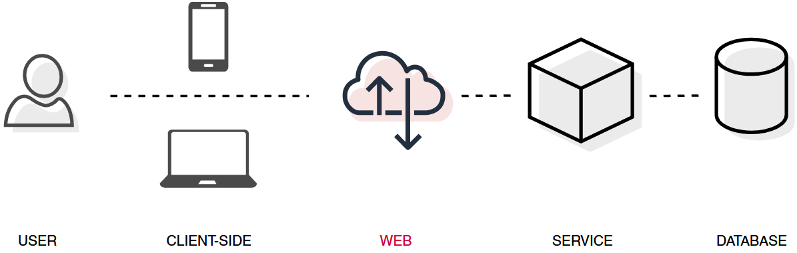
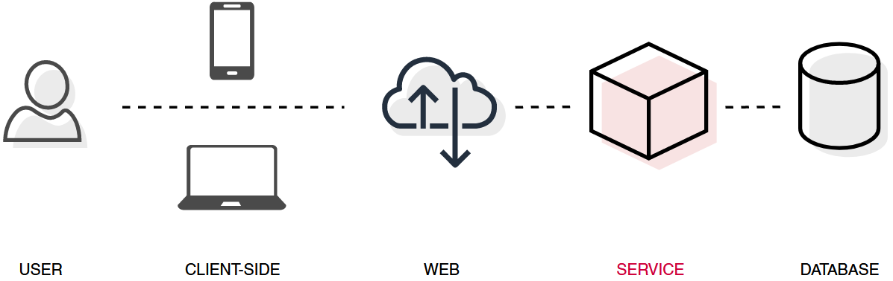
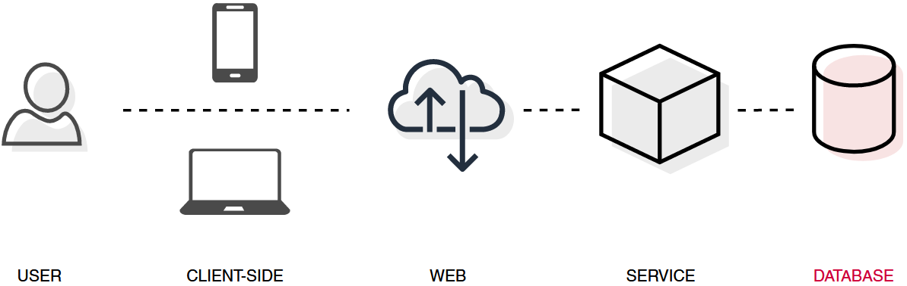

# Caching @ Digipolis

[TOC]

## Caching

In de informatietechnologie wordt een cache beschreven als een **snelle data opslag laag**, die een **subset** van data, gewoonlijk **tijdelijk**, **ontdubbelt**.

## Doel

Het primaire doel van caching is **snelheid (performance)**. Data wordt typisch in-memory opgeslagen om data access requests sneller te kunnen serven ten op zichte van de traditionele media (harde schijf, SSD).

Als secundaire doelen kan caching ook **high availability** en **resiliency** verhogen, onder andere door onderliggende systemen te ontlasten.

## Types

### Client-side

Bij client-side caching wordt data gecached in de client, zo dicht mogelijk bij de eindgebruiker. Client-side caching elimineert netwerk latency en instabiliteit. Client-side caching is 

* **private**, cache data verschilt per gebruiker.
* **local**, data wordt gecached waar het gebruikt wordt, zonder over een netwerk te gaan.

#### Browser

De browser bepaalt aan de hand van de eigen cache policies welke requests/responses gecached worden, hoe lang de data bewaard wordt en wanneer deze geïnvalideerd wordt.

**HTTP headers** zoals *Cache-Control en ETag* kunnen gebruikt worden om dit gedrag te beïnvloeden.

[Lees meer...](types/client-side/browser.md)

#### Device

Data kan ook in-memory of in local storage gecached worden op het device van de eindgebruiker. Denk aan iOS of Android apps, native windows applicaties,... Dit vraagt een **custom** implementatie. 

[Lees meer...](types/client-side/device.md)

### Web

**Server-side** tooling om het ophalen van web content te versnellen en de load op back-end systemen te verlichten. Web caching kan, afhankelijk van de implementatie, zowel

* **private** als **public** zijn. Cached data wordt gedeeld onder eindgebruikers, of niet.
* **local** als **centralized** zijn. Data wordt lokaal gecached op de plaats waar het gebruikt wordt, zonder netwerk hops. Data wordt centraal gecached, bereikbaar over het netwerk, als single-node of gedistribueerde cluster.

#### Gateway

Digipolis gebruikt Kong als gateway. Onze Kong versie ondersteunt de [Reverse Proxy Cache](https://docs.konghq.com/hub/kong-inc/proxy-cache/) van Kong **niet**. Dit type wordt bijgevolg niet verder onderzocht of aangeraden.

#### (Reverse) Proxy, Accelerator

Net als bij client-side caching, kan een proxy server-side met **HTTP headers** het cache gedrag van een service beïnvloeden.

Ook web of HTTP accelerators, zoals [Varnish](https://varnish-cache.org/), zijn in feite gewoon proxies, die recent of vaak gebruikte requests/responses cachen met als doel de latency te verlagen.

Ook dit wordt in feite niet echt gebruikt binnen Digipolis, al kan de **BFF** van een front-end applicatie beschouwd worden als proxy. In sommige gevallen kan het interessant zijn HTTP headers vanuit de BFF te manipuleren.

#### CDN

Het snel aanleveren van **web content**, zoals HTML pagina's, Javascript files, afbeeldingen, video's,... kan ook toevertrouwd worden aan een Content Delivery Network.

Een CDN positioneert zich **geografisch** op de netwerk **edge** en probeert zo de netwerk latency te verlagen. Een CDN brengt de bron met andere woorden fysiek naar de eindgebruikers toe.

Een CDN is altijd **public** en **centralized (distributed)**.

Digipolis services dienen een zeer lokaal publiek en bijgevolg is de kost van een CDN moeilijk te verantwoorden. Een eenvoudigere vorm van **[assets caching](types/web/assets.md)** via S3 of equivalent wordt wel aangemoedigd.

### Service

Een service kan er voor kiezen om eigen (**primaire**) data, of een aggretatie van (**secundaire**) data uit achterliggende services, te cachen. In geval van primaire data kan dit voordelig zijn om de performantie te verhogen, of de load op de primaire database te verlagen. In geval van secundaire data, kan dit naast performantie ook resiliency en high availability ten goede komen. Applicatief (service) caching kan zowel

* **private** als **public** zijn. Cached data wordt gedeeld onder eindgebruikers, of niet.
* **local** als **centralized** zijn. Data wordt lokaal gecached op de plaats waar het gebruikt wordt, zonder netwerk hops. Data wordt centraal gecached, bereikbaar over het netwerk, als single-node of gedistribueerde cluster.

#### Local

Een service kan er voor kiezen om lokaal, in-memory, data te cachen. Gezien het gedistribueerde landschap van Digipolis, waar zoveel mogelijk aangemoedigd wordt om stateless components te bouwen, wordt dit **niet** aangeraden. Requests worden geloadbalanced over verschillende K8S pods, waardoor éénzelfde gebruiker een verschillend response zou kunnen terugkrijgen bij dezelfde request.

#### Single-node

Een service kan ook gebruik maken van een externe bron om cache data weg te schrijven. Bij Digipolis wordt het gebruik van **Redis** aangeraden. Redis zorgt er voor dat services stateless blijven, maar toch verhoogde performantie (throughput, latency,..) kunnen aanbieden aan eindgebruikers.

[Lees meer...](types/service/store.md)

#### Distributed

### Database

### Shared

Een centraal cache kan in zekere zin verschillende services binnen hetzelfde domein serven. Meestal wordt dit **niet** door Digipolis aangeraden. We hanteren hier dezelfde regelen als bij het delen van primaire databases. Sharing zorgt voor **high coupling** tussen gebruikmakende services. Dit gaat in tegen de principes van Microservices.

## Moet mijn service cachen?

Neem eerst een stap terug. Welke beloftes over performantie, resiliency en high availability worden er gemaakt aan eindgebruikers, of worden er nagestreefd binnen Digipolis.

Algemeen geldt dat caching een oplossing voor een probleem moet zijn, geen inherent onderdeel van een applicatie architectuur. Caching brengt **kosten** en **complexiteit** met zich mee. De waarde moet daar tegen afgewogen worden. Mogelijks kan een tekortkoming aan één van bovenstaande beloftes met finetuning aan de bestaande architectuur of codebase opgelost worden. Dit moet altijd de eerste reflex zijn.

In andere gevallen kan een cache oplossingen bieden, wanneer 

* throughput omhoog moet.
* latency omlaag moet.
* back-end systemen ontlast moeten worden.
* Eventuele data inconsistencies door replicatie acceptabel zijn.
* Data geografisch gedistribueerd moet worden.

## Welke vorm van caching moet mijn service implementeren?

## Design Patterns

## Testing

## Aftercare

## Bronnen

* [Azure Caching Best Practices](https://docs.microsoft.com/en-us/azure/architecture/best-practices/caching)
* [AWS Caching Best Practices](https://aws.amazon.com/caching/)
* [AWS Caching challenges and strategies](https://aws.amazon.com/builders-library/caching-challenges-and-strategies/)
* [Blog - Caching strategies](https://codeahoy.com/2017/08/11/caching-strategies-and-how-to-choose-the-right-one/)
* [Blog - Caching design patterns](https://shahriar.svbtle.com/Understanding-writethrough-writearound-and-writeback-caching-with-python)
* [Blog - Caching strategies](https://nickcraver.com/blog/2019/08/06/stack-overflow-how-we-do-app-caching/)
* [Redis - Data Types](https://redis.io/topics/data-types-intro)
* [Redis - Pipelining](https://redis.io/topics/pipelining)
* [Redis - Eviction](https://docs.redis.com/latest/rs/administering/database-operations/eviction-policy/)
* [Redis - Transactions](https://redis.io/topics/transactions#cas)
* [Redis - Indexing](https://redis.io/topics/indexes)
* [Redis - Client side caching](https://redis.io/topics/client-side-caching)
* [Kong - Gateway caching](https://docs.konghq.com/gateway-oss/0.11.x/plugin-development/entities-cache/)
* [Kong - Reverse Proxy Cache](https://docs.konghq.com/hub/kong-inc/proxy-cache/)
* [Mozilla - HTTP caching](https://developer.mozilla.org/en-US/docs/Web/HTTP/Caching)
* [HTTP - RFC7234](https://datatracker.ietf.org/doc/html/rfc7234)

