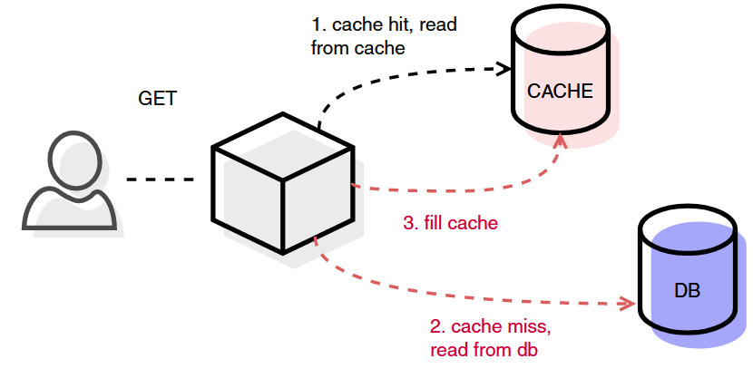

# Caching @ Digipolis

- [Caching @ Digipolis](#caching---digipolis)
  * [Caching](#caching)
  * [Doel](#doel)
  * [Types](#types)
    + [Client-side](#client-side)
    + [Web](#web)
    + [Service](#service)
    + [Database](#database)
    + [Shared](#shared)
  * [Moet mijn service cachen?](#moet-mijn-service-cachen-)
  * [Welke vorm van caching moet mijn service implementeren?](#welke-vorm-van-caching-moet-mijn-service-implementeren-)
  * [Design Patterns en strategie](#design-patterns-en-strategie)
    + [Reading](#reading)
    + [Writing](#writing)
    + [Invalidation](#invalidation-expiration)
    + [Eviction](#eviction)
    + [Seeding](#seeding)
  * [Testing](#testing)
  * [Aftercare](#aftercare)
  * [Bronnen](#bronnen)

## Caching

In de informatietechnologie wordt een cache beschreven als een **snelle data opslag laag**, die een **subset** van data, gewoonlijk **tijdelijk**, **ontdubbelt**.

## Doel

Het primaire doel van caching is **snelheid (performance)**. Data wordt typisch in-memory opgeslagen om data access requests sneller te kunnen serven ten opzichte van traditionele media (harde schijf, SSD).

Als secundaire doelen kan caching ook **high availability** en **resiliency** verhogen, onder andere door onderliggende systemen te ontlasten.

## Types

### Client-side


Bij client-side caching wordt data gecached in de client, zo dicht mogelijk bij de eindgebruiker. Client-side caching elimineert netwerk latency en instabiliteit. Client-side caching is 

* **private**, cache data verschilt per gebruiker.
* **local**, data wordt gecached waar het gebruikt wordt, zonder over een netwerk te gaan.

#### Browser

De browser bepaalt aan de hand van de eigen cache policies welke requests/responses gecached worden, hoe lang de data bewaard wordt en wanneer deze geïnvalideerd wordt.

**HTTP headers** zoals *Cache-Control en ETag* kunnen gebruikt worden om dit gedrag te beïnvloeden.

[Lees meer...](types/client-side/browser.md)

#### Device

Data kan ook in-memory of in local storage gecached worden op het device van de eindgebruiker. Denk aan iOS of Android apps, native Windows/OSX applicaties,... Dit vraagt een **custom** implementatie. 

[Lees meer...](types/client-side/device.md)

### Web


Bij web caching spreken we over **Server-side** tooling om het ophalen van web content te versnellen en de load op back-end systemen te verlichten. Web caching kan, afhankelijk van de implementatie, zowel

* **private** als **public** zijn. Cached data wordt gedeeld onder eindgebruikers, of niet.
* **local** als **centralized** zijn. Data wordt lokaal gecached op de plaats waar het gebruikt wordt, zonder netwerk hops. Of, data wordt centraal gecached, bereikbaar over het netwerk, als single-node of gedistribueerde cluster.

#### Gateway

Digipolis gebruikt Kong als gateway. Onze Kong *versie* ondersteunt de [Reverse Proxy Cache](https://docs.konghq.com/hub/kong-inc/proxy-cache/) van Kong **niet**. Dit type wordt bijgevolg niet verder onderzocht of aangeraden.

#### (Reverse) Proxy, Accelerator

Net als bij client-side caching, kan een proxy server-side met **HTTP headers** het cache gedrag van een service beïnvloeden.

Ook web of HTTP accelerators, zoals [Varnish](https://varnish-cache.org/), zijn in feite gewoon proxies, die recent of vaak gebruikte requests/responses of web content cachen met als doel de latency te verlagen.

Ook dit wordt in feite niet echt gebruikt binnen Digipolis, al kan de **BFF** van een front-end applicatie eventueel beschouwd worden als proxy. In sommige gevallen kan het interessant zijn HTTP headers vanuit de BFF te manipuleren.

#### CDN

Het snel aanleveren van **web content**, zoals HTML pagina's, Javascript files, afbeeldingen, video's,... kan ook toevertrouwd worden aan een Content Delivery Network.

Een CDN positioneert zich **geografisch** op de netwerk **edge** en probeert zo de netwerk latency te verlagen. Een CDN brengt de bron met andere woorden fysiek naar de eindgebruikers toe.

Een CDN is altijd **public** en **centralized (distributed)**.

Digipolis services dienen een zeer lokaal publiek en bijgevolg is de kost van een CDN moeilijk te verantwoorden. Een eenvoudigere vorm van **[assets caching](types/web/assets.md)** via S3 of equivalent wordt wel aangemoedigd.

### Service


Een service kan er voor kiezen om eigen (**primaire**) data, of een aggregatie van (**secundaire**) data uit achterliggende services, te cachen. In geval van primaire data kan dit voordelig zijn om de performance te verhogen, of de load op de primaire database te verlagen. In geval van secundaire data, kan dit naast performance ook resiliency en high availability ten goede komen. Applicatief (service) caching kan zowel

* **private** als **public** zijn. Cached data wordt gedeeld onder eindgebruikers, of niet.
* **local** als **centralized** zijn. Data wordt lokaal gecached op de plaats waar het gebruikt wordt, zonder netwerk hops. Of, data wordt centraal gecached, bereikbaar over het netwerk, als single-node of gedistribueerde cluster.

#### Local

Een service kan er voor kiezen om lokaal, in-memory, data te cachen. Gezien het gedistribueerde landschap van Digipolis, waar zoveel mogelijk aangemoedigd wordt om stateless components te bouwen, wordt dit **niet** aangeraden. Requests worden geloadbalanced over verschillende K8S pods, waardoor éénzelfde gebruiker een verschillend response zou kunnen terugkrijgen bij dezelfde request.

#### Single-node

Een service kan ook gebruik maken van een externe bron om cache data weg te schrijven. Bij Digipolis wordt het gebruik van **Redis** aangeraden. Redis zorgt er voor dat services stateless blijven, maar toch verhoogde performantie (throughput, latency,..) kunnen aanbieden aan eindgebruikers.

[Lees meer...](types/service/redis.md)

#### Distributed

Een service kan ook gebruik maken van een externe **gedistribueerde** bron om cache data weg te schrijven. Bij Digipolis wordt het gebruik van **Redis** aangeraden. Een gedistribueerde cluster verhoogt de high availability en persistance, maar verhoogt ook de kost, complexiteit en kans op data inconsistencies.

[Lees meer...](types/service/redis.md)

### Database


De meest gangbare databases hebben ook interne mechanismes om zaken als veel of recent gebruikte queries in-memory te houden. Queries die in-memory zitten kunnen veel sneller opgevraagd worden. Zo gebruikt Digipolis onder andere Mongodb, [dat WiredTiger gebruikt](https://docs.mongodb.com/manual/faq/fundamentals/#does-mongodb-handle-caching-) om queries vanuit cache te serven. Ook PostgreSQL cachet data in tables, indexes en in sommige gevallen, [query execution plans](https://www.postgresql.org/docs/9.4/plpgsql-implementation.html) (geen ad-hoc queries).

In de meeste gevallen wordt niet aangeraden om aan de defaults te sleutelen.

### Shared

Een centraal cache kan in zekere zin verschillende services binnen hetzelfde domein serven. Meestal wordt dit **niet** door Digipolis aangeraden. We hanteren hier dezelfde regels als bij het delen van primaire databases. Sharing zorgt voor **high coupling** tussen gebruikmakende services. Dit gaat in tegen de principes van Microservices.

## Moet mijn service cachen?

Neem eerst een stap terug. Welke beloftes over performantie, resiliency en high availability worden er gemaakt aan eindgebruikers, of worden er nagestreefd binnen Digipolis.

Algemeen geldt dat caching een oplossing voor een probleem moet zijn, geen inherent onderdeel van een applicatie architectuur. Caching brengt **kosten** en **complexiteit** met zich mee. De waarde moet daar tegen afgewogen worden. Mogelijks kan een tekortkoming aan één van bovenstaande beloftes met finetuning aan de bestaande architectuur of codebase opgelost worden. Dit moet altijd de eerste reflex zijn.

In andere gevallen kan een cache oplossingen bieden, wanneer 

* (read) **throughput** omhoog moet.
* **latency** omlaag moet.
* back-end systemen **ontlast** moeten worden.
* **availability** omhoog moet.
* Eventuele data **inconsistencies** (**stale** data) door replicatie acceptabel zijn.
* Data **geografisch** gedistribueerd moet worden.

## Welke vorm van caching moet mijn service implementeren?

*It depends...* Dit zijn enkele vragen die gesteld moeten worden:

* Moet een deel van de data **offline** beschikbaar blijven?

  Indien de applicatie (of een deel er van) altijd beschikbaar moet blijven voor een eindgebruiker, zelfs bij een netwerkstoring, moet er gebruik gemaakt worden van [client-side caching](#client-side).

* Is het erg om de **controle** over het cache voor een deel uit handen te geven aan een user?

  Ja? client-side caching is ongeschikt. De gebruiker kan dit ongevraagd leeghalen, en zo het systeem belasten. Of door slechte synchronisatie, bijvoorbeeld bij netwerkstoringen, kan het cache snel stale worden. Mogelijks biedt [web caching](#web) of [service caching](#service) een oplossing.

* Waar in de keten hebben we effectief de mogelijkheid om **aanpassingen** uit te voeren?

  Is het antwoord overal? Dan wordt aangeraden om [client-side caching](#client-side) met [service caching](#service) te combineren. Service caching geeft de mogelijkheid om met zeer veel controle op service niveau te bepalen welke data wel of niet belangrijk is om *hot* in het cache te houden. Client-caching geeft dan weer de mogelijkheid om zeer specifieke zaken, enkel voor één specifieke user, lokaal op te slaan. Daar kan het enorm snel en betrouwbaar opgehaald worden.

* Wordt er gezocht naar een **quick** (and cheap) **win** of is enige **complexiteit** en bijhorende **kost** aanvaardbaar voor een effectievere oplossing?

  Quick wins kunnen gehaald worden uit centrale componenten, waar geen aanpassingen in individuele applicaties nodig zijn. Mogelijks kan er gekeken worden naar caching op het niveau van de [Gateway](#gateway), [Proxies](#reverse-proxy-accelerator) of [HTTP accelerators](#reverse-proxy-accelerator). Of misschien kunnen de default caching mechanismen in centrale [databases](#database) verder gefinetuned worden.

* Is de applicatie **read-heavy**, **write-heavy** of een evenwichtige distributie?

  Deze vraag biedt geen uitsluitsel over *waar* in de keten een applicatie best kan cachen, maar kan wel een leidraad zijn in het kiezen van een **strategie**. De uitleg, voor- en nadelen van elke strategie of pattern kan gevonden worden in [design patterns](#design-patterns-en-strategie). Voor write-heavy applicaties kan bijvoorbeeld best gekozen worden voor *write-back / write-behind*.

* Wat is de **aard** van de te cachen data?

  Is de data statisch of dynamisch? Is consistency van de data mission-critical of onbelangrijk? Kan relevante data makkelijk gegroepeerd worden voor een grote groep gebruikers of niet? Kan makkelijk voorspeld worden welk subset van de data vaak opgevraagd zal worden?

  Gaat het over afbeeldingen, video's, HTML, CSS, JS? Gaat het over unieke userdata/sessions? Chatberichten? Gaat het over constant geüpdatete business data? Gaat het over time-based feeds? Metadata, configuratiedata? Berekende data met zware resource kost zoals reports?

## Design Patterns en strategie

Naast kiezen *waar* een applicatie zal cachen, moeten er ook weloverwogen design patterns of strategieën gekozen worden voor **[reading](#reading)**, **[writing](#writing)**, **[invalidation](#invalidation)**, **[eviction](#eviction)** en **[seeding](#seeding)**.

### Reading

Voor het uitlezen van een cache zijn er maar twee patterns. Algemeen kan genomen worden dat het cache altijd **eerst** uitgelezen moet worden, voor de database geraadpleegd wordt. Naast uitlezen bij **hits**, vullen beide patterns het cache ook aan bij **misses**. Reading patterns doen dus aan ***lazy-loading***, waardoor de eerste request altijd een miss zal veroorzaken. Best kunnen deze patterns *in combinatie met* een writing pattern gebruikt worden.

<u>**Digipolis moedigt het gebruik van cache-aside als reading pattern aan**</u>. Digipolis biedt geen support op tools als [RedisGears](https://github.com/RedisGears/RedisGears) en [AWS DAX](https://aws.amazon.com/dynamodb/dax/) die read-through haalbaar maken.

#### Cache-aside



##### Flow

1. De applicatie raadpleegt het cache.
   Bij een *hit*, wordt het resultaat teruggegeven aan de consumer.
2. Bij een *miss*, raadpleegt de applicatie de database en geeft dit terug aan de consumer.
3. De applicatie vult tenslotte ook het cache.

```python
def cache_aside(self, content_id):
    content = redis.get(content_id)
    if content is None:
        content = postgresql.get(content_id)
        if content is not None:
            redis.set(content_id, content)
    return content
```

##### Voor- en nadelen

| Voordelen                                                    | Nadelen                                                      |
| ------------------------------------------------------------ | ------------------------------------------------------------ |
| Het **datamodel** kan, in tegenstelling tot read-through, onafhankelijk evolueren | Veel **misses** (wanneer het pattern op zichzelf staat). Een miss zorgt onmiddelijk ook voor een hoge **latency**. |
| Uitstekend voor **read-heavy** workloads. Enkel keys die effectief vaak en recent opgevraagd worden zitten in het cache, geen ongebruikte data. | Relatief grote kans op **inconsistencies** (wanneer het pattern op zichzelf staat), aangezien enkel misses geüpdatet worden. |
| Cache-aside is **resilient**, de applicatie blijft werken, zolang het cache ***of*** de database beschikbaar is. | **Aanpassingen** aan applicatielogica nodig.                 |

#### Read-through


##### Flow

1. De applicatie raadpleegt het cache.
   Bij een *hit*, wordt het resultaat teruggegeven aan de consumer.
2. Bij een *miss*, raadpleegt **het cache of de cache library** de database en geeft dit terug aan de consumer.
3. Het cache vult zichzelf aan.

```python
def read_through(self, content_id):
    redis.get(content_id)
    # Cache or cache library consults db if necessary
```

##### Voor- en nadelen

| Voordelen                                                    | Nadelen                                                      |
| ------------------------------------------------------------ | ------------------------------------------------------------ |
| **Geen aanpassingen** aan applicatielogica nodig.            | Het **datamodel** moet volledig overeenstemmen met dat van de primaire database. |
| Uitstekend voor **read-heavy** workloads. Enkel keys die effectief vaak en recent opgevraagd worden zitten in het cache, geen ongebruikte data. | Read-through is minder **resilient** dan cache-aside. Het cache is een single-point-of-failure. |
|                                                              | Veel **misses** (wanneer het pattern op zichzelf staat). Een miss zorgt onmiddelijk ook voor een hoge **latency**. |
|                                                              | Relatief grote kans op **inconsistencies** (wanneer het pattern op zichzelf staat), aangezien enkel misses geüpdatet worden. |

### Writing

Voor het opvullen van een cache zijn er verschillende patterns. **<u>De juiste keuze hangt af van de situatie</u>**, al biedt Digipolis geen rechstreekse ondersteuning voor implementaties van write-through en write-behind waarbij het cache rechstreeks synchroniseert met de database, zonder tussenkomst van de applicatie.

#### write-through


##### Flow

1. Een consumer wil iets toevoegen, aanpassen of verwijderen in de applicatie.
2. De aanpassing wordt zowel in het cache als in de database opgeslagen. De volgorde is niet belangrijk. Opslaan in de database kan via applicatielogica, via het cache zelf of via de cache library.
3. De consumer krijgt pas resultaat wanneer beide acties voltooid zijn.

```python
def write_through(self, content):
    redis.write(content)
    postgresql.write(content)
```

##### Voor- en nadelen

| Voordelen                                                    | Nadelen                                                      |
| ------------------------------------------------------------ | ------------------------------------------------------------ |
| De kans op data **inconsistencies** is zeer klein, aanpassingen worden onmiddelijk in het cache opgenomen.<br />Aan de read kant zorgt dit voor **low-latency reads**, aangezien **first-misses** vermeden worden. | Writes zijn eerder traag, aangezien de commit naar de consumer toe pas gebeurd na voltooing van beide writes. Door de **high-latency writes** is dit mogelijks geen geschikt pattern voor **write-heavy** applicaties. |
| De kans op **data loss** is zeer klein.                      | **Aanpassingen** aan applicatielogica nodig.                 |
| **downstream requests** (richting database) zijn zeer beperkt. | Grote kans op **flooding** (vollopen). Ook data dat zelden opgevraagd wordt, zal initieel in het cache opgeslagen worden. |
| Nood aan data **pre-heating** / pre-warming is zeer klein.   |                                                              |

#### write-back / write-behind


##### Flow

1. Een consumer wil iets toevoegen, aanpassen of verwijderen in de applicatie.
2. De aanpassing wordt eerst opgeslagen in het cache.
3. De aanpassing wordt bevestigd aan de consumer.
4. De aanpassing wordt **pas daarna** (**asynchroon**) opgeslagen in de database.

```python
import asyncio

def write_back(self, content):
    redis.write(content)
    await def write_postgresql_async(content)
    
async def write_postgresql_async(self, content):
    postgresql.write(content)
```

##### Voor- en nadelen

| Voordelen                                                    | Nadelen                                                      |
| ------------------------------------------------------------ | ------------------------------------------------------------ |
| Lage **latency** en hoge **throughput** voor write-heavy applicaties. | **Aanpassingen** aan applicatielogica nodig.                 |
| Lage **latency** en hoge **throughput** voor read-heavy applicaties. | Grote kans op **flooding** (vollopen). Ook data dat zelden opgevraagd wordt, zal initieel in het cache opgeslagen worden. |
| Lage kans op **first-misses**.                               | Grotere kans op **data-loss** en **inconsistencies** door asynchrone verwerking. |
| Nood aan data **pre-heating** / pre-warming is zeer klein.   |                                                              |

#### write-around


##### Flow

1. Een consumer wil iets toevoegen, aanpassen of verwijderen in de applicatie.
2. De aanpassing wordt eerst opgeslagen in de database.
3. De aanpassing wordt bevestigd aan de consumer.

```python
def write_around(self, content):
    postgresql.write(content)
```

##### Voor- en nadelen

| Voordelen                                                    | Nadelen                                                      |
| ------------------------------------------------------------ | ------------------------------------------------------------ |
| De enige optie als er geen controle over de applicatiecode is. | Houdt enkel steek in **combinatie** met een reading pattern als cache-aside en read-through. |
| Kleine kans op **flooding** (vollopen). Enkel data dat echt opgevraagd wordt, bevindt zich in het cache (dankzij reading pattern). | Veel **downstream** requests na **first-misses**.            |
|                                                              | Nood aan data **pre-heating** / pre-warming is hoger.        |

#### Cron jobs


Een cron job of ander periodieke trigger haalt vult op vooraf bepaalde tijdstippen het cache aan.
Deze methode kan bijvoorbeeld voor een deel de risico’s van write-around (write) + cache-aside (read) mitigeren.

We kunnen dit ook bestempelen als [seeding](#seeding), zie verder hoofdstuk.

##### Voor- en nadelen

| Voordelen                                                    | Nadelen                                                      |
| ------------------------------------------------------------ | ------------------------------------------------------------ |
| **Geen aanpassingen** aan applicatielogica nodig.            | Grote kans op **first-misses** en downstream requests.       |
| Geeft de mogelijkheid enkel **exact** op te halen wat nodig is. | Grote kans op **inconsistencies**. (acceptabel bij low-write/statische applicaties) |
| Geeft de mogelijkheid de database enkel onder load te zetten op **luwe** momenten. (bijvoorbeeld ‘s nachts) |                                                              |
| Cache kan eventueel in **batch** aangevuld worden.           |                                                              |

#### Events

##### Data-carrying events


##### Voor- en nadelen

| Voordelen                                            | Nadelen                                                      |
| ---------------------------------------------------- | ------------------------------------------------------------ |
| **Asynchrone** afhandeling (load, availability,...). | Hoog risico voor **stale data** write-heavy applicaties.     |
| Weinig **downstream** **requests** nodig.            | Verhoogde **complexiteit** voor zowel business engine als PZA webplatform.<br />Houdt alleen steek als originele service al events uitstuurt. |

##### Non data-carrying events


##### Voor- en nadelen

| Voordelen                                                    | Nadelen                                   |
| ------------------------------------------------------------ | ----------------------------------------- |
| **Asynchrone** afhandeling (load, availability).             | Veel **downstream requests**.             |
| Kleinere kans op **stale data**, aangezien de effectieve data pas op het moment zelf wordt opgehaald. | Zeer hoge **complexiteit**.               |
|                                                              | **Broos** systeem (too many moving parts) |

### Invalidation (Expiration)

Het invalideren van een cache is een proces dat op basis van vooraf bepaalde levensduur data verwijdert. Invalidatie bestaat om zoveel mogelijk het stale worden van data in een cache te vermijden.

#### TTL

De meest eenvoudige vorm van expiration is een TTL (**time to live**). Dit wil zeggen, de tijd dat een key en zijn bijbehorende value nog leeft, alvorens verwijderd te worden, in seconden.

Deze kan zo gezet worden:

```sql
SET key_name value EX 60
```

Zonder de TTL expliciet te setten is deze **oneindig**. Het expliciet benoemen van de TTL op basis van de data is dus zeer belangrijk. Nog belangrijk is in productie te monitoren of deze TTL zinvol is en bij te sturen wanneer nodig. Zie hoofdstuk [Aftercare](#aftercare) voor meer informatie.

#### Dynamic TTL met backpressure event

Een ‘strenge’ TTL, dwz. Een zeer korte TTL kan altijd dynamisch aangepast worden door de applicatie, wanneer deze merkt dat er te veel downstream requests binnenkomen en een overload van de service dreigt.

### Eviction

Eviction is net als Invalidation een proces dat uiteindelijk data uit het cache zal verwijderen, maar gebruikt daarvoor **cachegrootte** als ‘trigger’, **niet tijd**. Wanneer het cache een vooraf bepaalde grootte overtreedt, kan het cache data vrijmaken op basis van een aantal algoritmes.

<u>**Digipolis adviseert in de meeste gevallen het gebruik van Least Recently Used in Redis (volatile-lru)**</u>. Deze policy staat standaar geconfigureerd.

#### Least Recently Used (LRU)

De minst **recent** gebruikte keys (en bijhorende values) worden uit het cache verwijderd, bij overtreding van de geconfigureerde grootte threshold.

| Voordelen                                                    | Nadelen                                                      |
| ------------------------------------------------------------ | ------------------------------------------------------------ |
| Het dure cache bevat bevat geen data al lang niet meer opgevraagd werd. Data dat vaak uitgelezen wordt zal dus meestal in het cache zitten, ook al is de data al oud. | LRU veroorzaakt cache misses bij data dat niet op een voorspelbare manier uitgelezen kan worden. |
|                                                              | Oude data kan lang in het cache blijven en heeft dus kans om stale te worden als invalidation policies of strategieën voor het opvullen van het cache niet goed geconfigureerd zijn. |

#### Least Frequently Used (LFU)

De **minst gebruikte** keys (en bijhorende values) worden uit het cache verwijderd, bij overtreding van de geconfigureerde grootte threshold.

| Voordelen                                                    | Nadelen                                                      |
| ------------------------------------------------------------ | ------------------------------------------------------------ |
| Het dure cache bevat nooit data dat nooit of amper opgevraagd wordt. Data dat vaak uitgelezen wordt zal dus meestal in het cache zitten, ook al is de data al oud. | LFU veroorzaakt cache misses bij data dat niet op een voorspelbare manier uitgelezen kan worden. |
|                                                              | Oude data kan lang in het cache blijven en heeft dus kans om stale te worden als invalidation policies of strategieën voor het opvullen van het cache niet goed geconfigureerd zijn. |

#### Most Recently Used (MRU)

De meest recent gebruikte keys (en bijhorende values) worden uit het cache verwijderd, bij overtreding van de geconfigureerde grootte threshold.

Deze strategie is enkel zinvol in zeer specifieke usecases. Wanneer kan het feit dat de data net uitgelezen is een indicatie zijn dat ze waarschijnlijk niet meer uitgelezen zal worden?

Denk bijvoorbeeld aan busstop informatie of vliegtuig vertrekuren.

#### First In First Out (FIFO)

Er wordt niet gekeken naar hoe vaak, of wanneer, keys gebruikt worden. De eerst toegevoegde keys (en bijhorende values) worden als eerste verwijderd.

Net als MRU is FIFO enkel in zeer specifieke usecases beter dan LRU of LFU.

### Seeding

#### Deployments

Bij deployments van downstream services is het aan te raden om de relevante delen van het cache leeg te maken en opnieuw op te vullen. Het datamodel kan gewijzigd zijn of data van voor de deployment kan stale geworden zijn.

Om dit efficiënt te laten verlopen kunnen calls naar Redis best in batch verstuurd worden. Hierbij willen we niet dat één call de hele transactie doet falen. Dit is wat we non-transactional request batching noemen.

In Redis kan dit met **Redis Pipelining**.

Via een seedscript (client) kunnen meerdere requests naar de Redis server gestuurd worden zonder telkens op het antwoord te wachten, Redis stuurt na afloop het antwoord in één reply terug.

```sql
def with_pipelining
    r = Redis.new
    r.pipelined {
        10000.times {
            r.ping
        }
    }
end
```

#### Cache Outage

Hetzelfde geldt bij een langdurige cache outage. Data kan opnieuw stale geworden zijn of de data is gewoon verdwenen door de invalidation of eviction policies.

Het cache kan best met non-transactional request batching weer opgevuld worden.

## Testing

## Aftercare

## Bronnen

* [Azure Caching Best Practices](https://docs.microsoft.com/en-us/azure/architecture/best-practices/caching)
* [AWS Caching Best Practices](https://aws.amazon.com/caching/)
* [AWS Caching challenges and strategies](https://aws.amazon.com/builders-library/caching-challenges-and-strategies/)
* [Blog - Caching strategies](https://codeahoy.com/2017/08/11/caching-strategies-and-how-to-choose-the-right-one/)
* [Blog - Caching design patterns](https://shahriar.svbtle.com/Understanding-writethrough-writearound-and-writeback-caching-with-python)
* [Blog - Caching strategies](https://nickcraver.com/blog/2019/08/06/stack-overflow-how-we-do-app-caching/)
* [Blog - System Design Primer](https://github.com/donnemartin/system-design-primer#cache)
* [Redis - Caching Use cases](https://redis.com/solutions/use-cases/caching/)
* [Redis - Data Types](https://redis.io/topics/data-types-intro)
* [Redis - Pipelining](https://redis.io/topics/pipelining)
* [Redis - Eviction](https://docs.redis.com/latest/rs/administering/database-operations/eviction-policy/)
* [Redis - Transactions](https://redis.io/topics/transactions#cas)
* [Redis - Indexing](https://redis.io/topics/indexes)
* [Redis - Client side caching](https://redis.io/topics/client-side-caching)
* [RedisGears - Write-through / Write-behind](https://github.com/RedisGears/rgsync)
* [Kong - Gateway caching](https://docs.konghq.com/gateway-oss/0.11.x/plugin-development/entities-cache/)
* [Kong - Reverse Proxy Cache](https://docs.konghq.com/hub/kong-inc/proxy-cache/)
* [Mozilla - HTTP caching](https://developer.mozilla.org/en-US/docs/Web/HTTP/Caching)
* [HTTP - RFC7234](https://datatracker.ietf.org/doc/html/rfc7234)

