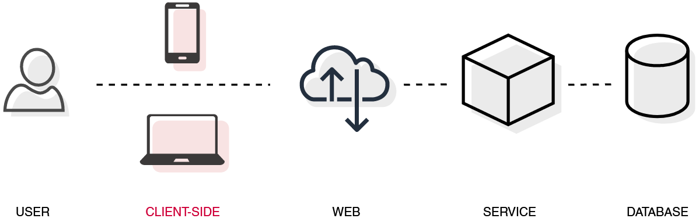

# Client-side browser caching



De browser bepaalt aan de hand van de eigen cache policies welke requests/responses gecached worden, hoe lang de data bewaard wordt en wanneer deze geïnvalideerd wordt.

**HTTP headers** zoals *Cache-Control en ETag* kunnen gebruikt worden om dit gedrag te beïnvloeden.

Browser cache policy kan gemanipuleerd worden door zowel **request** als server **response**!

## Request of response

Het zetten van HTTP headers om cache gedrag te beïnvloeden kan zowel bij request (client) als response (server) nuttig zijn.

### Server

Manipuleer HTTP cache headers vanuit de server wanneer:

* cache-gedrag voor alle consumers hetzelfde mag zijn.
* de hop het dichtst bij de primaire bron kent de data en dus het juiste cache gedrag het beste.
* er kan geen **controle** over de clients uitgeoefend worden.

Manipuleer HTTP headers vanuit de client wanneer:

* de client **unieke**, extra cache requirements nodig heeft om performantie redenen
* de cache-gevoeligheid beïnvloed wordt door **input** van de user.
  Bijvoorbeeld [no-store](#No-store) kan gezet worden wanneer de user aangeeft dat het om gevoelige data gaat.

### Client

## Cache-control

De cache-control header kan gezet worden met meerdere instructies

```
cache-control: public/private, max-age=xxx, no-cache, no-store
```

### Public / Private

```
cache-control: public
```

Public geeft de instructie dat de opgevraagde resource **overal** gecached mag worden. Dat wil zeggen dat ook bijvoorbeeld een gateway, proxy, of HTTP accelerator hier gebruik van kan maken. Zie [Web](#web) voor meer info over web caching. Ook client-side kan deze resource dan gecached worden.

```
cache-control: private
```

Private geeft de instructie dat de opgevraagde resource per definitie private is, bijvoorbeeld user specific data.  De resource kan dan enkel client-side gecached worden.

### Max-age

```
cache-control: max-age=10000
```

Max-age geeft de instructie dat de resource slechts een beperkte tijd (aangegeven in seconden) gecached mag worden. Bij het verstrijken van die tijd, moet de resource gerefreshed worden.

Het juiste aantal seconden is sterk afhankelijk van de te cachen data. Authenticatie cookies hebben bijvoorbeeld compleet andere requirements dan user profile data, zoals een profielfoto.

### No-cache

```
cache-control: no-cache
```

No-cache geeft de instructie dat de resource enkel gecached mag worden na een validatie request bij de origin server.

### No-store

```
cache-control: no-store
```

No-store geeft de instructie dat de resource onder geen enkele vorwaarde gecached mag worden.

### Overige

Cache-control heeft nog meer opties, bekijk deze uitgebreid op [de developer documentatie van Mozilla](https://developer.mozilla.org/en-US/docs/Web/HTTP/Headers/Cache-Control#syntax).

## Extra HTTP headers

### Expires

```
expires: Expires: Sat, 13 May 2022 07:00:00 GMT
```

Expires geeft een absoluut alternatief tegenover het relatieve [max-age](#max-age).
**Max-age heeft voorrang op expires**!

### ETag

```
ETag: "33a64df551425fcc55e4d42a148795d9f25f89d4"
```

**ETag kan enkel in een response van de server geset worden**! Etag geeft een soort van versioned id mee met de teruggegeven resource. De client of eventuele proxies kunnen op basis van die id zien of de resource al dan niet gewijzigd is en dus gewijzigd moet worden in hun cache.
